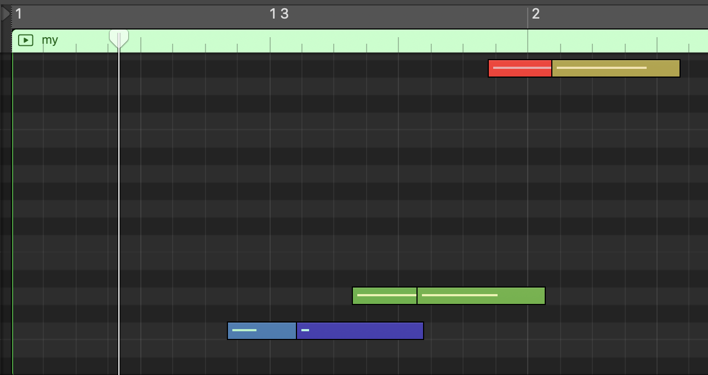
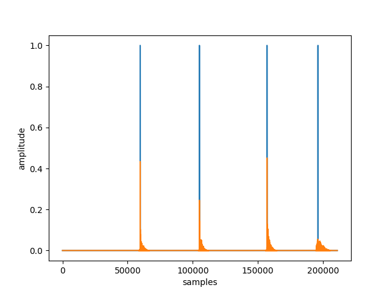
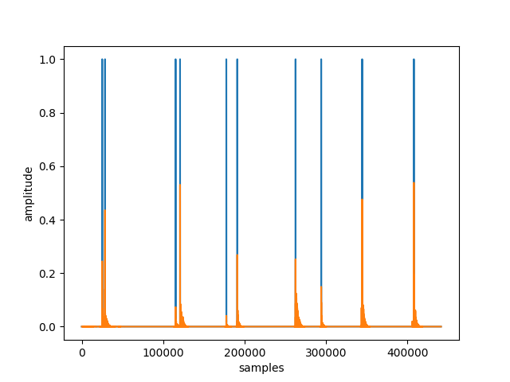
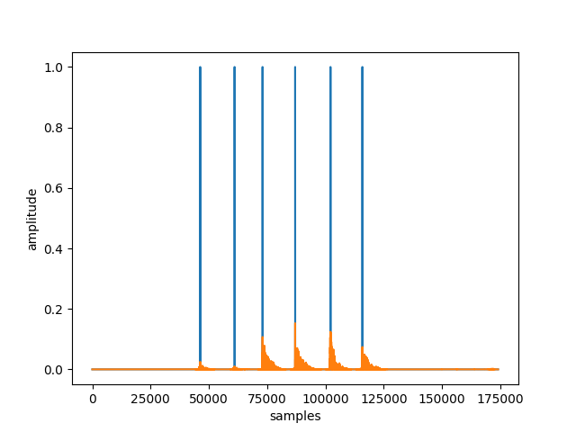
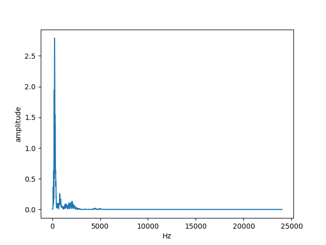
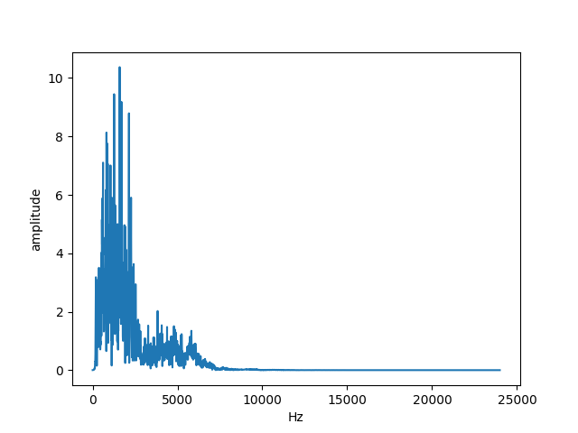
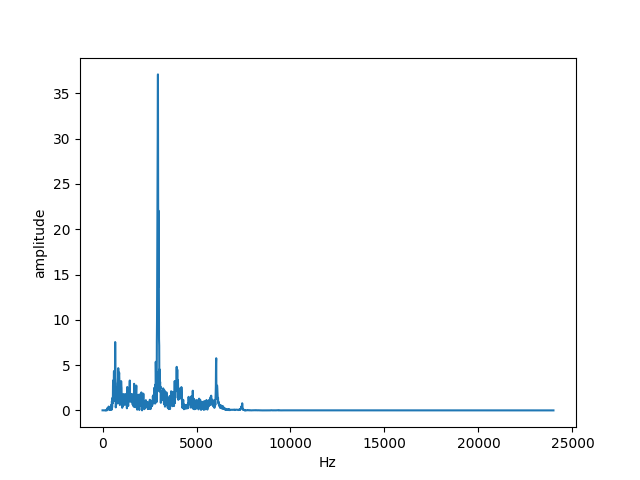
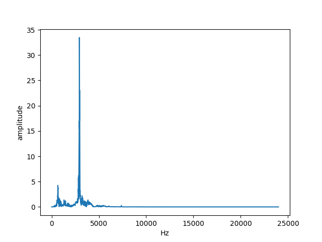
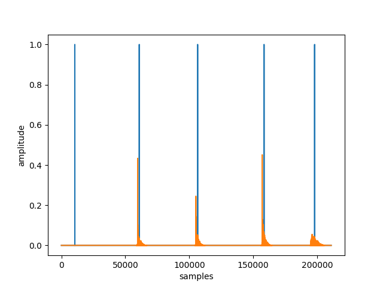

# DrumKitSim
The goal of this project is to create realistic MIDI drum tracks which are not time-quantized and retain natural dynamic contrast.
This will be accomplished by analyzing user-inputted audio recordings of users drumming on any number of distinct surfaces which have unique timbres. Each drum sound hit will then be recognized, isolated, and normalized. Tone and tambre will then be recognized by performing machine learning on audio samples; each distinct surface being hit in the recording will be mapped to a virtual, simulated drum. Then, the program will insert samples depending on cluster labelings and amplitudes, creating a new drum track.

# Updates
### Apr 9, 2025

MIDI is now working!

I was able to use `3sounds.wav` and converted that to MIDI notes, which can be seen here in Logic Pro:



I've also added a text-based GUI which allows the user to map each sound to a drum.

### Mar 26, 2025

#### Improved peak finding algorithm

I noticed that peaks were slightly right-shifted. I wanted to make them accurate to the initial attack of the note. 

Librosa peak finding seems a bit faster, possibly more intuitive. I think it forgoes convolution. I intended to use my own convolution algorithm, but it seems the intuitive method is pretty accurate. 

Here's the new graphs:





#### Segmentation and clustering
The grand finale (of today's updates, anyway)!

After all this time, I've finally done it--implemented clustering. Here's the breakdown:

I've recorded a new sample, `datasets/3sounds.wav`, which 3 different kinds of sounds with two samples of each.

First, we clean the audio data and grab the peaks. We can see we found 6 of them! Perfect. (audio is orange, while peaks are represented as blue)



Then, we convert them to FFT frequencies. We can graph the output as such. Pretty cool how they look similar, right? All according to plan.








Finally, we run the Gaussian mixture model.... "drum"-roll, please! (Am I ready for fatherhood?)

```
File name: ./datasets/3sounds.wav
Sampling (frame) rate =  48000
Total samples (frames) =  174080
Duration =  3.6266666666666665
./datasets/3sounds.wav
6
5000
[2 2 0 0 1 1]
```

We can see that our program realized out of those 6 sounds, the two consecutive ones were the most similar. Nice! We'll have to do a bigger test soon to see how well it really works!

Long-term, the idea is to be able to do a mixed model to capture two "drums" being hit at the same time. However, I think the functions I'm using right now simply give back the label with the highest probability. (I suppose if we're finding the distance of the datapoint to the cluster, ever model has multiple probabilities, but it's easy enough to change later.)

Next goal is probably to integrate MIDI output to get an end-to-end demo working.

### Mar 25, 2025
Added peak finding algorithm (with ≥80% accuracy in initial tests!)

This marks an improvement over the initial segmentation method, as that would not distinguish individual hit sounds close together with a shared noise floor.

Ultimately, the goal is to be able to support 16th notes, 32nd notes, and eventually flams. We'll see, but wanted to get the initial audio pipeline set up.

Here's the initial results.

Using `datasets/snaps.wav`, we can see 5 peaks found for 4 snaps.



Using `datasets/TightSnaps.wav`, we can see, for 7 major sounds, there are 7 peaks. Amazing!

The flams aren't working quite yet, but we can revisit that in the near future. Onto the machine learning!


### Jun 8, 2024
Added rudimentary audio segmentation based on audio above/below amplitude threshold

### Feb 16, 2022
Gaussian Mixture Model currently performs the best, even before FFT. 
Trials to be run
* Using vs not using FFT
* More GMM
* Soft-clustering techniques
* Different eps for DBSCAN
* Using CNN to process a Mel Spectrogram

# Dependencies
`python3 -m pip freeze > requirements.txt`