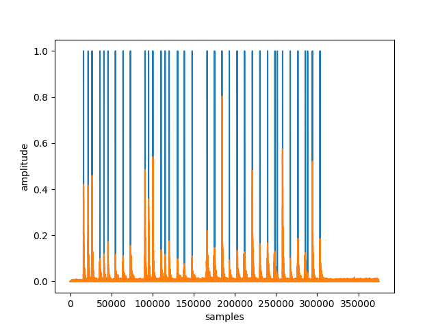

# DrumKitSim
The goal of this project is to create realistic MIDI drum tracks which are not time-quantized and retain natural dynamic contrast.
This will be accomplished by analyzing user-inputted audio recordings of users drumming on any number of distinct surfaces which have unique timbres. Each drum sound hit will then be recognized, isolated, and normalized. Tone and tambre will then be recognized by performing machine learning on audio samples; each distinct surface being hit in the recording will be mapped to a virtual, simulated drum. Then, the program will insert samples depending on cluster labelings and amplitudes, creating a new drum track.

# Using this package
Run the interactive code
```
python3 -m src.app.main
```

To test, run
```
python3 -m pytest test/unit -v
python3 -m pytest test/simulation -v
```

To format, run
```
black .
```

Dependencies are listed in requirements.txt. To save them, run
```
python3 -m pip freeze > requirements.txt
```

# Updates
### Nov 23, 2025
Added Mel Frequency Cepstral Coefficients as features. Let's break that down for our use case:

- A Fast Fourier Transformation (FFT) converts a representation of a signal over time to a sum of component sinusoidal frequencies. For our use case, this means a snapshot of time (maybe 22.5k samples, or half a second) transformed from amplitude-over-time to amplitude-over-frequency. It squashes the half-second and treats it as a single point in time with a width of 0.25 seconds on either side. It helps us get a view of, for a drum hit sample, "What fundamental frequencies make this sound unique?" This is one of the main tools I have used to visualize data so far.
  - One of the great things about performing an FFT is, at a high level, it abstracts a pattern from the data. Looking at an audio file itself, you see a seemingly-random sequence of positive and negative numbers. Let's remember this concept of an FFT finding wave patterns in complex data, as it will help us later.
- A spectrogram is a sequence of FFTs in time order. This can be used to represent change in the sound over time while still retaining the idea of fundamental frequencies. They are typically shown as colors on a 2D picture, where lighter colors represent higher amplitudes. It's like if you made an FFT into 3D, and looked down from a bird's eye view. The peaks of the mountains would be brightest.

This is a great start, but has a few problems.

For example, for the drumkit sim, I want to play various sounds which I can tell apart; by that logic, I believe the computer can also tell them apart. However, this is not inherently so; we need to teach the computer to think about sound the way we do. One problem is that the spectrogram is a very raw representation of the sound. It doesn't take into account human perception of sound.

Another issue is that the FFT/spectrogram is quite noisy. It's not the FFT's fault, but rather the nature of our data. Despite being cleaned, sound is so finnicky that even a small change in the way the user hits an object can change its sound data drastically. For machine learning models, this is not ideal. We need a way to make the model more robust, filtering out low-level noise to get a better picture of the high-level data. Some common approaches are noise removal, smoothing data (using something like a moving average) and peak finding, etc.

This is where the Mel Frequency Cepstrum (MFC) comes in.
- "Mel" is short for melody. This is the conversion to "human hearing" I mentioned previously. It counts low frequences as more important, as they are more discernible to the human ear than different high frequencies. Consider two sound files of different quality (44.1 vs 48 kHz). You probably can't tell the difference, because that highest ~4kHz is not very distinctive to the human ear. Now, consider taking away the *lowest* 4kHz, and you've lost all 8 (count them, 8) octaves up to a B7, in terms of fundamental frequency. So, the Mel component means taking a logarithm of the domain of the FFT (frequency) to convert it to more sensible, human measurements.
  - To do this, we are effectively dumping the amplitude data into bins of frequency size n. As the frequencies get higher, the buckets get bigger, as changes to higher frequencies don't matter as much to the human ear. Each bin will produce a single, new amplitude-datapoint for a key Mel frequency. This helps smooth out small peaks in the data as it is effectively being averaged over an interval.
- The logged data is finally hit with another Fourier transformation to convert that data into simpler patterns and waveforms. From these layered sinusoids, we get the Mel Frequency Cepstral Coefficients.

When we machine learn on these Cepstral Coefficients which have been 1) adjusted to mimic human hearing using logarithms (if I can hear the difference in the drum, so can the computer) and 2) simplified by smoothing the data, we find the results much more robust to variation in playing and noise. Training data is now 100% accurate!

The last hurdle here is still getting it to recognize the double stops. Back to tweaking the GMM parameters, now that we have the right features!

I find it hard to believe that anything worked initially by throwing in all 2000 samples! Machine learning is magical but not magic. I'm really impressed by the results of the MFCC-based GMM.

MFCCs are not entirely robust to noise. For this reason, I've kept noise removal. However, I've also removed the function to boost lower frequencies. Now that we are using the MFCC, we can more accurately train on these low frequencies.


### Nov 11, 2025
Added double stops source code, unit, and simulation tests.

However, the new simulation test (and sample) is currently failing because the FFTs are not normalized enough. Lower frequency sounds are being considered overall lower amplitude. We need to scale the amplitudes by some kind of inverse function to boost lower frequencies while lowering higher frequencies. This may be due to the fact that there are more points which can be sampled at lower amplitudes due to the nature of sound waves.



### Sept 23, 2025
Overhauled the project's file structure to logically separate components. This also comes in preparation for a training and validation framework.

### Apr 9, 2025

MIDI is now working!

I was able to use `3sounds.wav` and converted that to MIDI notes, which can be seen here in Logic Pro:


I've also added a text-based GUI which allows the user to map each sound to a drum.

### Mar 26, 2025

#### Improved peak finding algorithm

I noticed that peaks were slightly right-shifted. I wanted to make them accurate to the initial attack of the note. 

Librosa peak finding seems a bit faster, possibly more intuitive. I think it forgoes convolution. I intended to use my own convolution algorithm, but it seems the intuitive method is pretty accurate. 

Here's the new graphs:


#### Segmentation and clustering
The grand finale (of today's updates, anyway)!

After all this time, I've finally done it--implemented clustering. Here's the breakdown:

I've recorded a new sample, `datasets/3sounds.wav`, which 3 different kinds of sounds with two samples of each.

First, we clean the audio data and grab the peaks. We can see we found 6 of them! Perfect. (audio is orange, while peaks are represented as blue)


Then, we convert them to FFT frequencies. We can graph the output as such. Pretty cool how they look similar, right? All according to plan.


Finally, we run the Gaussian mixture model.... "drum"-roll, please! (Am I ready for fatherhood?)

```
File name: ./datasets/3sounds.wav
Sampling (frame) rate =  48000
Total samples (frames) =  174080
Duration =  3.6266666666666665
./datasets/3sounds.wav
6
5000
[2 2 0 0 1 1]
```

We can see that our program realized out of those 6 sounds, the two consecutive ones were the most similar. Nice! We'll have to do a bigger test soon to see how well it really works!

Long-term, the idea is to be able to do a mixed model to capture two "drums" being hit at the same time. However, I think the functions I'm using right now simply give back the label with the highest probability. (I suppose if we're finding the distance of the datapoint to the cluster, ever model has multiple probabilities, but it's easy enough to change later.)

Next goal is probably to integrate MIDI output to get an end-to-end demo working.

### Mar 25, 2025
Added peak finding algorithm (with ≥80% accuracy in initial tests!)

This marks an improvement over the initial segmentation method, as that would not distinguish individual hit sounds close together with a shared noise floor.

Ultimately, the goal is to be able to support 16th notes, 32nd notes, and eventually flams. We'll see, but wanted to get the initial audio pipeline set up.

Here's the initial results.

Using `datasets/snaps.wav`, we can see 5 peaks found for 4 snaps.


Using `datasets/TightSnaps.wav`, we can see, for 7 major sounds, there are 7 peaks. Amazing!

The flams aren't working quite yet, but we can revisit that in the near future. Onto the machine learning!


### Jun 8, 2024
Added rudimentary audio segmentation based on audio above/below amplitude threshold

### Feb 16, 2022
Gaussian Mixture Model currently performs the best, even before FFT. 
Trials to be run
* Using vs not using FFT
* More GMM
* Soft-clustering techniques
* Different eps for DBSCAN
* Using CNN to process a Mel Spectrogram
