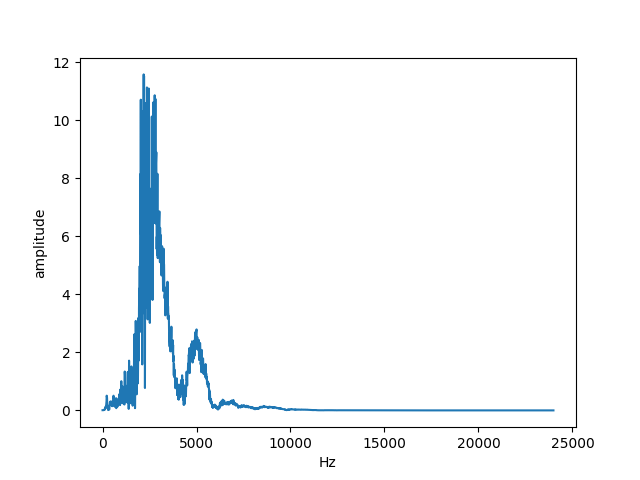
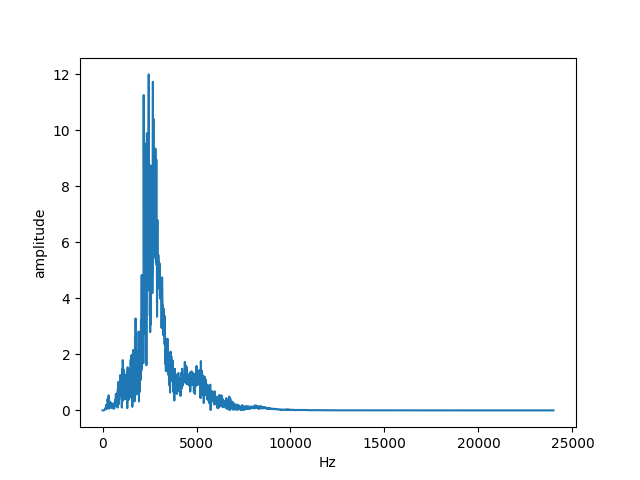
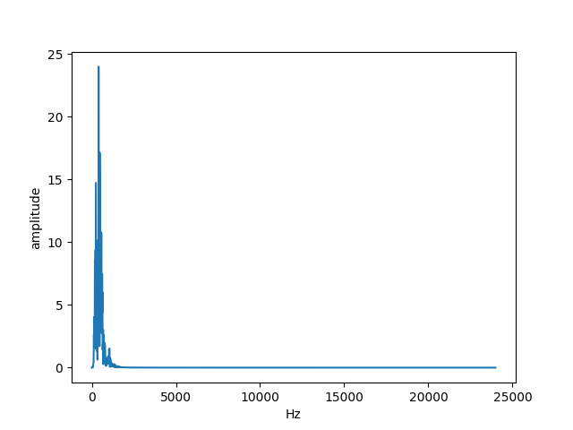

# DrumKitSim
The goal of this project is to create realistic MIDI drum tracks which are not time-quantized and retain natural dynamic contrast.
This will be accomplished by analyzing user-inputted audio recordings of users drumming on any number of distinct surfaces which have unique timbres. Each drum sound hit will then be recognized, isolated, and normalized. Tone and tambre will then be recognized by performing machine learning on audio samples; each distinct surface being hit in the recording will be mapped to a virtual, simulated drum. Then, the program will insert samples depending on cluster labelings and amplitudes, creating a new drum track.

# Updates
### Mar 26, 2025

#### Implemented segmentation and FFT
Segmented audio and implemented FFT with graph. We can now see our results

#### Improved peak finding algorithm

I noticed that peaks were slightly right-shifted. I wanted to make them accurate to the initial attack of the note. 

Librosa peak finding seems a bit faster, possibly more intuitive. I think it forgoes convolution. I intended to use my own convolution algorithm, but it seems the intuitive method is pretty accurate. 

Here's the new graphs:

### Mar 25, 2025
Added peak finding algorithm (with ≥80% accuracy in initial tests!)

This marks an improvement over the initial segmentation method, as that would not distinguish individual hit sounds close together with a shared noise floor.

Ultimately, the goal is to be able to support 16th notes, 32nd notes, and eventually flams. We'll see, but wanted to get the initial audio pipeline set up.

Here's the initial results.

Using `datasets/snaps.wav`, we can see 5 peaks found for 4 snaps.

Using `datasets/TightSnaps.wav`, we can see, for 7 major sounds, there are 7 peaks. Amazing!

The flams aren't working quite yet, but we can revisit that in the near future. Onto the machine learning!

### Jun 8, 2024
Added rudimentary audio segmentation based on audio above/below amplitude threshold

### Feb 16, 2022
Gaussian Mixture Model currently performs the best, even before FFT. 
Trials to be run
* Using vs not using FFT
* More GMM
* Soft-clustering techniques
* Different eps for DBSCAN
* Using CNN to process a Mel Spectrogram

# Dependencies
`python3 -m pip freeze > requirements.txt`